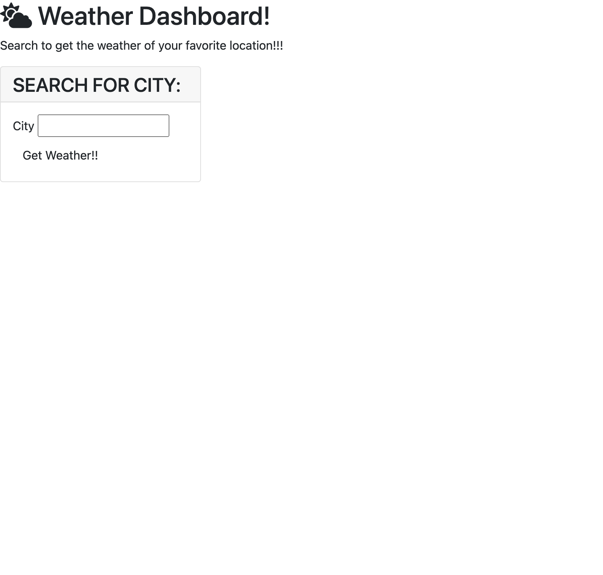

# Code Quiz

[For deployed version, click me!!!](https://jlentz17.github.io/weather-dashboard/)

In the sixth week of bootcamp, I was given the assignment of making a weather dashboard with JavaScript and server-side API's.

# Description 

## User Story

AS A traveler
I WANT to see the weather outlook for multiple cities
SO THAT I can plan a trip accordingly

## Acceptance Criteria

GIVEN a weather dashboard with form inputs
WHEN I search for a city
THEN I am presented with current and future conditions for that city and that city is added to the search history
WHEN I view current weather conditions for that city
THEN I am presented with the city name, the date, an icon representation of weather conditions, the temperature, the humidity, the wind speed, and the UV index
WHEN I view the UV index
THEN I am presented with a color that indicates whether the conditions are favorable, moderate, or severe
WHEN I view future weather conditions for that city
THEN I am presented with a 5-day forecast that displays the date, an icon representation of weather conditions, the temperature, the wind speed, and the humidity
WHEN I click on a city in the search history
THEN I am again presented with current and future conditions for that city

## Built With

* [Visual Studio Code](https://code.visualstudio.com/)
* [JavaScript](https://developer.mozilla.org/en-US/docs/Web/JavaScript)
* [CSS 3](https://developer.mozilla.org/en-US/docs/Web/CSS)
* [HTML 5](https://developer.mozilla.org/en-US/docs/Web/Guide/HTML/HTML5)
* [Markdown](https://markdownguide.org/cheat-sheet/)
* [Open Weather Map API's](https://openweathermap.org/api)

## Contributors

Jeremy Lentz   <jlentz17@gmail.com>   &copy; 2020 Jeremy Lentz. All rights reserved.